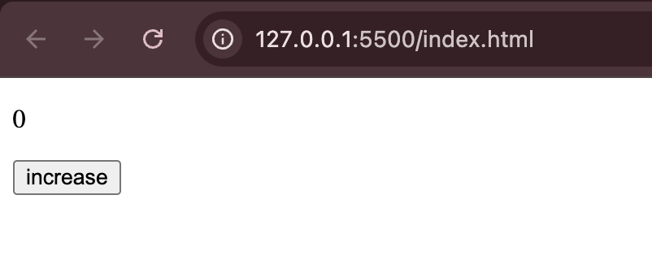
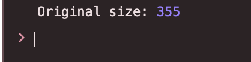
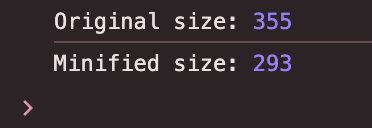

This whole series we are going to talk a lot about "Modern Build Tools" & why they are necessary. 

To begin, let's start with a simple "Counter" project. Since we're not using any package manager (NPM | YARN | ...) or build tools, we need to import the functionality of react via CDNs. We've also imported the babel script...why? Because...if not, then how would you transform the "JSX" to "JS" becuase browsers haven't catch up with the rapid frameworks updates and culture...meaning they can't render JSX. JS - is the only langauge they understand...currently!

```
<!DOCTYPE html>
<html lang="en">
  <head>
    <meta charset="UTF-8" />
    <meta name="viewport" content="width=device-width, initial-scale=1.0" />
    <title>React Project without build tools</title>
    <script
      crossorigin
      src="https://unpkg.com/react@18/umd/react.development.js"
    ></script>
    <script
      crossorigin
      src="https://unpkg.com/react-dom@18/umd/react-dom.development.js"
    ></script>
    <script src="https://unpkg.com/@babel/standalone/babel.min.js"></script>
  </head>
  <body>
    <div id="root"></div>
    <script type="text/babel">
      const { useState } = React;

      function App() {
        const [count, setCount] = useState(0);

        return (
          <div>
            <p>{count}</p>
            <button onClick={() => setCount(count + 1)}>increase</button>
          </div>
        );
      }
      ReactDOM.createRoot(document.getElementById("root")).render(<App />);
    </script>
  </body>
</html>
```


Run this index.html file via live server in vscode and you'll be able to see below screen. You can play with the counter.


Now our goal is to find out the size of our main code. To do that, lets add another script which will help us console log the size of the counter application.

```
<!DOCTYPE html>
<html lang="en">
  <head>
    <meta charset="UTF-8" />
    <meta name="viewport" content="width=device-width, initial-scale=1.0" />
    <title>React Project without build tools</title>
    <script crossorigin src="https://unpkg.com/react@18/umd/react.development.js"></script>
    <script crossorigin src="https://unpkg.com/react-dom@18/umd/react-dom.development.js"></script>
    <script src="https://unpkg.com/@babel/standalone/babel.min.js"></script>
  </head>
  <body>
    <div id="root"></div>
    <script type="text/babel" id="app-script">
      const { useState } = React;
      function App() {
        const [count, setCount] = useState(0);
        return (
          <div>
            <p>{count}</p>
            <button onClick={() => setCount(count + 1)}>increase</button>
          </div>
        );
      }
      ReactDOM.createRoot(document.getElementById("root")).render(<App />);
    </script>
    <script>
      window.addEventListener('load', async () => {
        const appScript = document.getElementById('app-script');
        const code = appScript.textContent;
        const result = await Babel.transform(code, { presets: ['react'] });
        console.log('Original size:', code.length);
        appScript.textContent = result.code;
        appScript.type = 'text/javascript';
      });
    </script>
  </body>
</html>
```

Run this and you'll be able to see the size as "355" bytes in chrome's console. That's the original size of our counter component which is totally fine but if you look closely and if you're someone who's crazy with optimizations, you might have already spotted the area.



-> Blank lines
-> comments
-> long variable/function names
-> unnecessary whitespaces
-> ... and a lot of other things.

If we could somehow remove above things, we might be able to save some space right? - which is where minification comes into the scene.

Let's add terser (minification tool) to our little experiment and calculate the size again. 

```
<!DOCTYPE html>
<html lang="en">
  <head>
    <meta charset="UTF-8" />
    <meta name="viewport" content="width=device-width, initial-scale=1.0" />
    <title>React Project without build tools</title>
    <script crossorigin src="https://unpkg.com/react@18/umd/react.development.js"></script>
    <script crossorigin src="https://unpkg.com/react-dom@18/umd/react-dom.development.js"></script>
    <script src="https://unpkg.com/@babel/standalone/babel.min.js"></script>
    <script src="https://cdn.jsdelivr.net/npm/terser/dist/bundle.min.js"></script>
  </head>
  <body>
    <div id="root"></div>
    <script type="text/babel" id="app-script">
      const { useState } = React;
      function App() {
        const [count, setCount] = useState(0);
        return (
          <div>
            <p>{count}</p>
            <button onClick={() => setCount(count + 1)}>increase</button>
          </div>
        );
      }
      ReactDOM.createRoot(document.getElementById("root")).render(<App />);
    </script>
    <script>
      window.addEventListener('load', async () => {
        const appScript = document.getElementById('app-script');
        const code = appScript.textContent;
        const result = await Babel.transform(code, { presets: ['react'] });
        const minified = await Terser.minify(result.code);
        console.log('Original size:', code.length);
        console.log('Minified size:', minified.code.length);
        appScript.textContent = minified.code;
        appScript.type = 'text/javascript';
      });
    </script>
  </body>
</html>
```

Size after adding terser:



It's a no-brainer. You can spot the difference in size. That's magic right...i mean a tool that can handle this for us without having to worry about all those unwanted things. 

Just imagine how much we can save for a production level applications. This was just for a single component and we can already see the results.

Well that's what minifcation does...and you can look up the definiton of minification on Google.

NOTE: Try to console log the code before and after minification. You'll be amazed to see the results.

